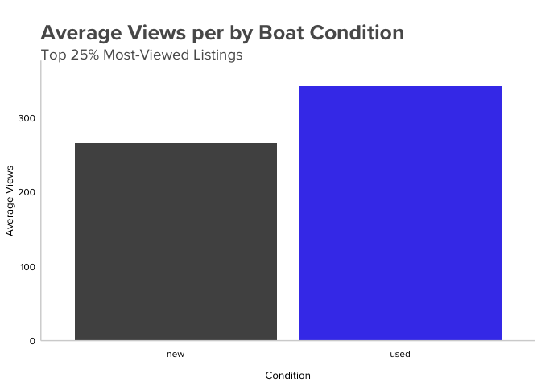

# Boat Sales Analysis
<br>  
  
## PROBLEM

In this case study, a marketing team is preparing a weekly newsletter for boat owners to help them get more views of their boat and stay on top of market trends. What are the common characteristics and features among boats that get the most views?
<br>
<br>
## GOAL

*Generate Seller Insights* 💡

We need to generate insights for our sellers to share in our weekly newsletter. These insights will help them stay on top of the latest trends and get more views on our platform. To do this, I will explore the common **characteristics** and **features** among boats that get the **most views**. 
<br>
<br>
## TRENDS

### 1. Do the most expensive boats get the most views?

I first examined a specific question that was posed by the marketing team: Do the most expensive boats get the most views? To figure this out, I created a scatter plot of the price and views and added a regression line using `geom_smooth`.


```r
boat_data %>% 
  mutate(log_price = log(price)) %>% 
  ggplot(aes(log_price, views)) +
  geom_point(alpha = .8, color = "#7e7e7e") +
  geom_smooth(se = FALSE, color = '#4446eb') +
  labs(x = "Price", 
       y = "Views", 
       title = "\nListing Views by Price") +
  theme_dc() +
  scale_y_continuous(expand = expansion(mult = c(0, .1))) +
  scale_x_continuous(expand = expansion(mult = c(0, .1)))
```

<!-- -->

**<span style="color:#4446eb">No</span>, a higher listing price does not get more views.** There is no statistically significant correlation between price and listing views.
<br>
<br>
### 2. <span style="color:#4446eb">Switzerland</span> is a popular market for boats

**🇨🇭 Boats listed in Switzerland make up 25% of all views on the site**.

```r
boat_data %>% 
  group_by(country) %>% 
  summarize(total_views = sum(views)) %>% 
  ungroup() %>% 
  mutate(percent_views = total_views / sum(total_views) * 100) %>% 
  slice_max(percent_views, n = 5) %>% 
  kable(col.names = c("Country", "Total Views", "Percent Views"),
        caption = "Table 1.1 Listing views by country")
```


Table: Table 1.1 Listing views by country

|Country     | Total Views| Percent Views|
|:-----------|-----------:|-------------:|
|Switzerland |      374431|     25.386839|
|Germany     |      286993|     19.458445|
|Italy       |      209958|     14.235387|
|Netherlands |      121982|      8.270516|
|France      |      118098|      8.007176|
<br>

In addition, the highest viewed boats are those listed in Swiss Francs (CHF). **<span style="color:#4446eb">Listings made in CHF get 181%</span> more views** on average than other types of currencies.

<!-- -->
<br>
<br>
### 3. <span style="color:#4446eb">Used boats</span> get the most views

For this next part of the analysis I looked at the most viewed listings, the top 25% of listings with the most views, as they were the highest performers for viewership.


```r
top_25_perc <- boat_data %>% 
  filter(views > quantile(boat_data$views, prob = .75))
```
<br>

After plotting new vs used boat listings, we can see that **of the top 25% most viewed listings, <span style="color:#4446eb">78%</span> are used...**


```r
top_25_perc %>% 
  filter(!is.na(condition)) %>% 
  ggplot(aes(condition, fill = ifelse(condition == "used", "Highlighted", "Normal"))) +
  geom_bar(show.legend = FALSE) +
  scale_fill_manual(name = "area", values=c("#4446eb","#515151")) +
  labs(x = "Condition", 
       y = "Number of Listings", 
       title = "\nMost Viewed Listings by Boat Condition",
       subtitle = "Top 25% Most-Viewed Listings") +
  theme_dc() +
  scale_y_continuous(expand = expansion(mult = c(0, .1)))
```

<!-- -->


**... and <span style="color:#4446eb">used boats get 21% more views</span> on average than new boats**.


```r
boat_data %>% 
  filter(!is.na(condition)) %>% 
  group_by(condition) %>% 
  summarize(total = n(),
            avg_views = mean(views)) %>% 
  ggplot(aes(condition, avg_views, fill = ifelse(condition == "used", "Highlighted", "Normal"))) +
  geom_col(show.legend = FALSE) +
  scale_fill_manual(name = "area", values=c("#4446eb","#515151")) +
  labs(x = "Condition", 
       y = "Average Views", 
       title = "\nAverage Views per by Boat Condition",
       subtitle = "Top 25% Most-Viewed Listings") +
  theme_dc() +
  scale_y_continuous(expand = expansion(mult = c(0, .1)))
```

<!-- -->
<br>
<br>
### 4. <span style="color:#4446eb">Motor Yachts, Sports Boats, and Cabin Boats</span> are popular 

**🚤 Motor Yachts, Sports Boats, and Cabin Boats make up over <span style="color:#4446eb">51%</span> of most-viewed listings**. These three categories outperform the other 21 types of boats combined.


```r
top_25_perc %>%
   filter(!is.na(boat_type)) %>% 
  mutate(boat_type_top = case_when(
    str_detect("Sport Boat", boat_type) ~ "Sport Boats, Motor Yachts, Cabin Boats",
    str_detect("Motor Yacht", boat_type) ~ "Sport Boats, Motor Yachts, Cabin Boats",
    str_detect("Cabin Boat", boat_type) ~ "Sport Boats, Motor Yachts, Cabin Boats",
    TRUE ~ "Other"
  )) %>% 
  count(boat_type_top, wt = views) %>%  
  ggplot(aes(boat_type_top, n, fill = ifelse(boat_type_top == "Sport Boats, Motor Yachts, Cabin Boats", "Highlighted", "Normal"))) +
  geom_col(show.legend = FALSE) +
  scale_fill_manual(name = "area", values=c("#4446eb","#515151")) +
  labs(x = "Boat Type", 
       y = "Views", 
       title = "\nViews by Boat Type",
       subtitle = "Top 25% Most-Viewed Listings") +
  theme_dc() +
  scale_y_continuous(expand = expansion(mult = c(0, .1)))
```

<!-- -->
<br>
<br>
### 5. Listings with <span style="color:#4446eb">multiple tags</span> get more views

🏷 When comparing listings by number of boat type tags, those with **multiple tags received more views**. Adding **multiple tags increases views by over <span style="color:#4446eb">26%</span>** on average per tag.


```r
top_25_perc_sep %>% 
  group_by(no_tags) %>% 
  summarize(avg_views = mean(views)) %>% 
  ggplot(aes(no_tags, avg_views, fill = ifelse(no_tags == 3, "Highlighted", "Normal"))) +
  geom_col(show.legend = FALSE) +
  scale_fill_manual(name = "area", values=c("#4446eb","#515151")) +
  labs(x = "Number of Boat Type Tags", 
       y = "Average Views", 
       title = "\nAverage Views by Number of Boat Type Tags",
       subtitle = "Top 25% Most-Viewed Listings") +
  theme_dc() +
  scale_y_continuous(expand = expansion(mult = c(0, .1)))
```

<!-- -->
<br>
<br>
# Recommendations

### Getting more views for our sellers 👀

**<span style="color:#4446eb">Sellers should consider the latest trends when choosing inventory</span>**

- Swiss buyers are very active

- Used boats are popular

- Motor Yachts, Sports Boats, and Cabin Boats are popular


**<span style="color:#4446eb">Sellers should add multiple tags when applicable and complete listing entries</span>**

- Listings with multiple tags,  when applicable, will increase sellers’ exposure

- Encourage sellers to fill out their listings completely so we can give them more recommendations: more data = more insights!
<br>
<br>
<br>
<br>
